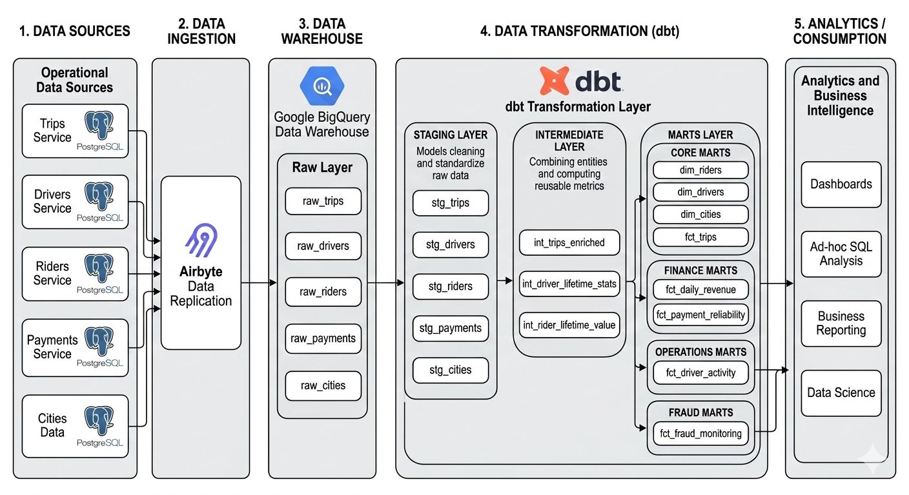
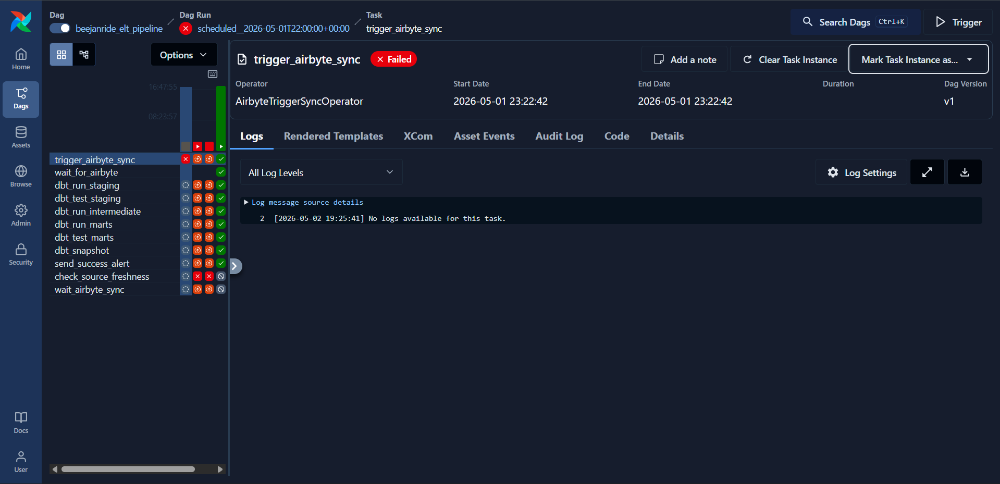
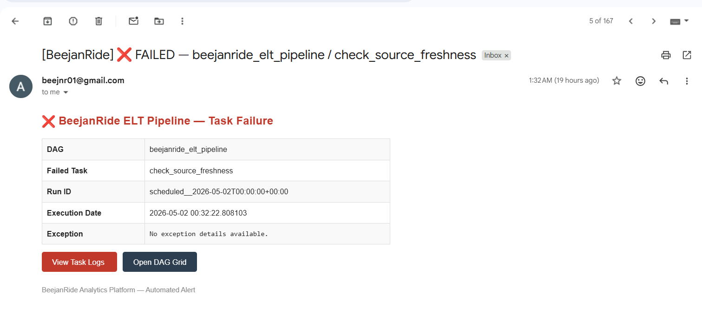

# BeejanRide Analytics Platform

> **Production-grade ELT pipeline:** PostgreSQL → Airbyte → BigQuery → dbt → Apache Airflow

[](https://www.getdbt.com/)
[](https://airflow.apache.org/)
[](https://cloud.google.com/bigquery)
[](https://airbyte.com/)

---

## Table of Contents

- [Overview](#overview)
- [Stack](#stack)
- [Architecture](#architecture)
- [Orchestration Design](#orchestration-design)
- [DAG Structure](#dag-structure)
- [Idempotency Strategy](#idempotency-strategy)
- [Failure Handling & Monitoring](#failure-handling--monitoring)
- [dbt Project Structure](#dbt-project-structure)
- [Data Models](#data-models)
- [Data Quality](#data-quality)
- [Macros](#macros)
- [Running Locally](#running-locally)
- [Screenshots](#screenshots)
- [Design Decisions](#design-decisions)
- [Author](#author)

---

## Overview

BeejanRide Analytics is a production-grade ELT data warehouse for a ride-hailing platform. It transforms raw transactional data from PostgreSQL into a clean, analytics-ready BigQuery warehouse — fully automated and orchestrated with Apache Airflow.

The platform supports analysis across:

- Trip activity and operational metrics
- Rider behaviour and lifetime value (RFM segmentation)
- Driver performance and churn signals
- Revenue trends and payment reliability
- Fraud detection and monitoring
- Driver history via SCD Type 2 snapshots

---

## Stack

| Component | Tool | Role |
|---|---|---|
| Source Database | PostgreSQL | Transactional source — 6 raw tables |
| Ingestion | Airbyte (self-hosted) | CDC and full-refresh syncs to BigQuery |
| Cloud Warehouse | Google BigQuery | All storage and query execution |
| Transformation | dbt Core | All SQL transformation logic |
| Orchestration | Apache Airflow 3.1.8 | Scheduling, dependency management, alerting |
| Version Control | GitHub | dbt + Airflow project, CI/CD |

---

## Architecture

<!-- Replace the image below with your updated architecture diagram (include Airflow layer) -->
> 📌 **Place your updated architecture diagram here.**
> Export from draw.io as `architecture_diagram.png` and save to `images/architecture_diagram.png`



The pipeline follows a five-layer pattern:

```
PostgreSQL  ──[Airbyte]──►  raw  ──[dbt]──►  staging  ──►  intermediate  ──►  marts
                                                                    ▲
                                                              [Airflow schedules
                                                               every 2 hours]
```

**raw** — Airbyte writes here. Nothing else touches it.

**staging** — One model per source table. Deduplicates, casts types, renames columns. All views except `stg_driver_status_events` which is incremental (high-volume event table — full scans are expensive).

**intermediate** — Business logic lives here. Joins, derived metrics, fraud flags, LTV calculations. `int_trips_enriched` is a table (4 downstream consumers — ephemeral would re-execute the full enrichment SQL 4× per run).

**marts** — Star schema. Incremental fact tables partitioned by date, dimension tables as tables.

**snapshots** — `drivers_snapshot` tracks SCD Type 2 history for driver status, vehicle, and rating changes.

---

## Orchestration Design

Airflow is the orchestration layer that makes the entire pipeline hands-off. Before Airflow, every dbt run and Airbyte sync was triggered manually.

### What Airflow Does

| Responsibility | How |
|---|---|
| Schedule the full pipeline | Every 2 hours — cron: `0 */2 * * *` |
| Trigger Airbyte sync | `AirbyteTriggerSyncOperator` — one task covers all 6 streams |
| Wait for sync completion | `AirbyteJobSensor` — polls every 30 seconds, frees worker while waiting |
| Run dbt staging | `PythonOperator` → `dbt run --select staging` |
| Gate on staging tests | `PythonOperator` → `dbt test --select staging` — pipeline stops here if tests fail |
| Run dbt intermediate + marts | `PythonOperator` — strict sequential dependencies |
| Test marts | `PythonOperator` → `dbt test --select marts` |
| Run snapshot (daily only) | `ShortCircuitOperator` gates snapshot to midnight runs only |
| Alert on failure | Email via Gmail SMTP on any task failure |
| Alert on success | Email on final task completion |
| Support manual backfills | Separate DAG: `beejanride_backfill` with `--full-refresh` |

### Airflow Connections (set up in UI → Admin → Connections)

| Connection ID | Type | Settings |
|---|---|---|
| `airbyte_default` | HTTP | Host: `host.docker.internal`, Port: `8000` |

SMTP credentials (Gmail) and GCP credentials are injected via environment variables in `.env` — no additional Airflow connections needed.

---

## DAG Structure

### `beejanride_elt_pipeline` — runs every 2 hours

```
trigger_airbyte 
        │
 wait_airbyte          
        │
  dbt_run_staging
        │
  dbt_test_staging          
        │
dbt_run_intermediate
        │
   dbt_run_marts
        │
  dbt_test_marts
        │
   dbt_snapshot
        │
 send_success_alert
```

Every task has `on_failure_callback` set — a failure anywhere sends an immediate email with the task name, DAG, run ID, and a direct link to the Airflow task log.

### `beejanride_backfill` — manual trigger only (`schedule=None`)

```
backfill_dbt_staging
        │
  test_dbt_staging
        │
backfill_dbt_intermediate
        │
 backfill_dbt_marts
        │
   test_dbt_marts
        │
   dbt_snapshot
        │
 send_success_alert
```

Trigger from the Airflow UI: **DAGs → beejanride_backfill → Trigger DAG ▶**


### File Structure

```
your-project/
├── dags/
│   ├── beejanride_main_dag.py        # Main ELT pipeline — every 2 hours
│   ├── beejanride_backfill_dag.py    # Manual full-refresh — trigger from UI
│   └── utils/
│       ├── __init__.py
│       ├── dbt_runner.py             # Runs dbt CLI as subprocess
│       └── alerts.py                 # Email callbacks (failure + success)
├── beejan_analytics/                 # dbt project
│   ├── dbt_project.yml
│   ├── models/
│   │   ├── staging/
│   │   ├── intermediate/
│   │   └── marts/
│   ├── snapshots/
│   └── macros/
├── gcp/
│   └── service_account.json
├── images/                           
├── docker-compose.yaml
├── .env
└── README.md
```

---

## Idempotency Strategy

Re-running the pipeline for the same time window must produce the same result — never duplicates, never missing data.

| Mechanism | What it does |
|---|---|
| `insert_overwrite` on date partitions | Re-running for the same date overwrites that partition — never appends duplicates |
| `catchup=False` | Airflow never automatically backfills missed historical intervals |
| `max_active_runs=1` | Prevents two concurrent DAG runs from writing to the same partition simultaneously |
| Airbyte CDC | Incremental syncs are idempotent by design — same source records produce same raw rows |
| Airbyte full refresh | Drops and rewrites the destination table — deterministic |
| Backfill `--full-refresh` | Completely rebuilds all incremental models from source — deterministic rebuild |
| 1-day lookback window | Incremental models reprocess yesterday's partition to catch late-arriving records |

---

## Failure Handling & Monitoring

### Task-level failures

Every task in both DAGs has `on_failure_callback=on_failure` set in `default_args`. When any task fails, Airflow immediately sends an email to `ALERT_EMAIL` containing:

- Which DAG and task failed
- The run ID
- A direct link to the task log in the Airflow UI

### Retries

The main pipeline DAG has `retries=1` with a 5-minute `retry_delay` on each task. This handles transient failures (network hiccups, temporary BigQuery unavailability) without manual intervention.

The backfill DAG has `retries=0` — if a full rebuild fails, fix the root cause and re-trigger.

### Test gating

`dbt_test_staging` sits between ingestion and transformation. If any staging test fails (nulls in primary keys, bad enum values, broken FK relationships), the pipeline stops before writing anything to intermediate or marts. This prevents bad data from propagating downstream silently.

### Sensor timeout

`AirbyteJobSensor` has a `timeout=3600` (1 hour). If an Airbyte sync takes longer than an hour, the task fails and the failure email fires. `mode="reschedule"` ensures the sensor releases its Celery worker slot while waiting rather than holding it hostage.

---

## Screenshots

### DAG Graph View

<!-- Save screenshot to images/dag_graph.png -->
> 📌 **Place your Airflow DAG graph view screenshot here.**


---

### Successful DAG Run



---

### Failed DAG Run


---

### Failure Email Notification



---

### Backfill Execution

<!-- Save screenshot to images/dag_backfill.png -->
> 📌 **Place your backfill DAG run screenshot here.**


---

## dbt Project Structure

```
beejan_analytics/
├── dbt_project.yml
├── packages.yml               (dbt_utils, dbt_expectations, audit_helper)
├── models/
│   ├── staging/               (sources.yml + 6 staging models)
│   ├── intermediate/          (3 intermediate models)
│   └── marts/
│       ├── core/              (fct_trips, dim_drivers, dim_riders, dim_cities)
│       ├── finance/           (fct_daily_revenue, fct_payment_reliability)
│       ├── operations/        (fct_driver_activity)
│       └── fraud/             (fct_fraud_monitoring)
├── snapshots/                 (drivers_snapshot — SCD Type 2)
├── macros/
│   ├── revenue_calculations.sql
│   └── custom_tests.sql
└── analyses/
    └── sample_analytical_queries.sql
```

---

## Data Models

### Staging

One model per source table. All views except `stg_driver_status_events`.

| Model | Materialisation | Key Operations |
|---|---|---|
| `stg_trips` | view | Dedup on `trip_id`, cast types, normalise status enums |
| `stg_drivers` | view | Dedup on `driver_id`, cast rating to NUMERIC |
| `stg_riders` | view | Dedup on `rider_id`, uppercase country |
| `stg_payments` | view | Dedup on `payment_id`, rename fee to `processing_fee` |
| `stg_cities` | view | No dedup needed, initcap `city_name` |
| `stg_driver_status_events` | incremental | Partition by `event_date`, 1-day lookback |

### Intermediate

| Model | Materialisation | Key Logic |
|---|---|---|
| `int_trips_enriched` | table | Joins trips + payments + cities + drivers + riders. Calculates `trip_duration_minutes`, `net_revenue`, `surge_revenue_contribution`, all fraud flags |
| `int_driver_lifetime_stats` | view | Aggregates lifetime trips, revenue, churn flag, `last_online_at` per driver |
| `int_rider_lifetime_value` | view | Calculates rider LTV and RFM segmentation (champion / loyal / recent / at_risk / churned) |

### Marts — Fact Tables

| Table | Schema | Grain | Materialisation |
|---|---|---|---|
| `fct_trips` | core | 1 row per trip | incremental (daily partition) |
| `fct_driver_activity` | operations | 1 row per driver per day | incremental (daily partition) |
| `fct_daily_revenue` | finance | 1 row per city per trip type per day | incremental (daily partition) |
| `fct_payment_reliability` | finance | 1 row per provider per city per day | table |
| `fct_fraud_monitoring` | fraud | 1 row per fraud-suspect trip | table |

### Marts — Dimension Tables

| Table | Schema | Key Attributes |
|---|---|---|
| `dim_drivers` | core | `driver_status`, `driver_tier`, `lifetime_trips`, `is_churned`, `days_since_last_trip` |
| `dim_riders` | core | `rider_segment` (RFM), `rider_ltv`, `total_trips`, `is_referred` |
| `dim_cities` | core | `city_name`, `country`, `launch_date`, `months_since_launch` |

### Snapshot

`drivers_snapshot` — SCD Type 2. Tracks `driver_status`, `vehicle_id`, and `rating` changes with full history via `dbt_valid_from` / `dbt_valid_to`. Runs once daily (midnight) via the `ShortCircuitOperator` gate in the main DAG.

### ERD


### dbt Lineage


---

## Incremental Strategy

All high-volume fact tables use `insert_overwrite` on date partitions with a 1-day lookback window to catch late-arriving records.

**Why not full refresh every time?** Full refresh re-scans the entire trip history on every run. At scale that's slow and expensive. Incremental keeps run time flat as the dataset grows — only new partitions are processed.

**The tradeoff is complexity.** Schema changes require a manual `--full-refresh`. Late data beyond the 1-day lookback window gets missed without intervention. Use the `beejanride_backfill` DAG for this — it rebuilds everything with `--full-refresh` in a controlled, monitored run.

---

## Data Quality

Tests are defined in YAML across all layers. 

**Generic tests** — `not_null`, `unique`, `relationships`, `accepted_values` on all primary keys, foreign keys, and enum columns.

**Custom tests:**

| Test | Checks |
|---|---|
| `assert_no_negative_revenue` | `gross_revenue`, `net_revenue` ≥ 0 |
| `assert_positive_trip_duration` | Completed trips have duration > 0 |
| `assert_completed_trip_has_payment` | Completed trips have ≥ 1 successful payment |

**Source freshness** — configured per table. Trips error after 2 hours. Status events error after 3 hours. Static tables (cities) exempt.

---

## Macros

| Macro | What it does |
|---|---|
| `calc_net_revenue(fare, fee)` | Deducts 20% platform cut and processing fee from gross fare |
| `calc_duration_minutes(start, end)` | Safe timestamp diff, returns NULL if ≤ 0 |
| `safe_divide(num, denom)` | NULL instead of divide-by-zero |
| `generate_surrogate_key_from_cols` | Thin wrapper on `dbt_utils.generate_surrogate_key` |

---

## Running Locally

### Prerequisites

- Docker + Docker Compose
- GCP service account JSON with BigQuery access
- Airbyte running locally on port `8000`

### Setup

```bash
# 1. Clone the repository
git clone https://github.com/YOUR_USERNAME/beejanride-analytics.git
cd beejanride-analytics

# 2. Add your GCP service account
mkdir -p gcp
cp /path/to/your/service_account.json gcp/service_account.json

# 3. Set your Airflow UID (Linux only)
echo "AIRFLOW_UID=$(id -u)" >> .env

# 4. Start all services
docker compose up -d

# 5. Wait ~60 seconds then verify all services are healthy
docker compose ps
```

### Create the Airbyte connection in Airflow UI

Go to `http://localhost:8080` → **Admin → Connections → +**

| Field | Value |
|---|---|
| Connection ID | `airbyte_default` |
| Connection Type | `HTTP` |
| Host | `host.docker.internal` |
| Port | `8000` |

### Trigger your first run

```bash
# Confirm Airflow can see both DAGs
docker compose exec airflow-scheduler airflow dags list

# Unpause and trigger the main pipeline
docker compose exec airflow-scheduler airflow dags unpause beejanride_elt_pipeline
docker compose exec airflow-scheduler airflow dags trigger beejanride_elt_pipeline
```

Or use the Airflow UI at `http://localhost:8080`.

### Run a full backfill

Trigger from the UI: **DAGs → beejanride_backfill → Trigger DAG ▶**

Or via CLI:

```bash
docker compose exec airflow-scheduler airflow dags trigger beejanride_backfill
```

### dbt commands (inside container)

```bash
# Open a shell in the scheduler container
docker compose exec airflow-airflow-scheduler-1 bash

# Then run dbt directly
dbt source freshness --project-dir $DBT_PROJECT_DIR --profiles-dir $DBT_PROFILES_DIR
dbt build --project-dir $DBT_PROJECT_DIR --profiles-dir $DBT_PROFILES_DIR
dbt snapshot --project-dir $DBT_PROJECT_DIR --profiles-dir $DBT_PROFILES_DIR
dbt docs generate && dbt docs serve
```

---

## Design Decisions

### One Airbyte UUID for all 6 streams

All six source tables (trips, drivers, riders, payments, cities, driver_status_events) are synced under a single Airbyte connection. This means one `AirbyteTriggerSyncOperator` and one `AirbyteJobSensor` — a cleaner DAG graph with the same result.

### Email over Slack for alerts

Airflow's built-in SMTP email system is already configured via environment variables. No webhook setup, no third-party dependency. Alerts include the task name, DAG, run ID, and a direct link to the log.

### Snapshot gated to midnight only

`drivers_snapshot` runs SCD Type 2 — it only needs to capture changes once per day. A `ShortCircuitOperator` checks if the scheduled hour is `00:xx` and skips the snapshot task on all other 2-hour intervals. This avoids 11 unnecessary snapshot runs per day.

### Sensor in `reschedule` mode

`AirbyteJobSensor` uses `mode="reschedule"` rather than `mode="poke"`. In poke mode, the sensor holds a Celery worker slot for the entire duration of the Airbyte sync (potentially 20+ minutes). Reschedule mode releases the slot between polls, keeping the worker pool available for other tasks.

### int_trips_enriched as TABLE not ephemeral

`int_trips_enriched` is referenced by 4 downstream marts. If it were ephemeral, the full enrichment SQL (joining 5 tables with fraud flag calculations) would re-execute once per consumer — 4 times per run. Materialising it as a table computes it once and is meaningfully cheaper at scale.

### insert_overwrite over MERGE

BigQuery's `MERGE` is more expensive than partition overwrite for append-heavy tables. Reprocessing the last 1–2 date partitions handles late-arriving data at lower cost, with simpler SQL.

---

## What's Next

- **`dim_vehicles`** — `vehicles_raw` with make, model, fuel type, capacity would unlock proper fleet analytics
- **Multi-currency normalisation** — all revenue is in local currency; a GBP exchange rate seed is needed for cross-city comparisons
- **dbt Semantic Layer** — define `revenue`, `ltv`, `churn_rate` as official metrics for consistent BI tool queries
- **Streaming for status events** — move `driver_status_events` to Pub/Sub → BigQuery streaming for sub-minute driver monitoring
- **ML feature tables** — `int_rider_lifetime_value` and `int_driver_lifetime_stats` are ready to serve as feature store inputs for churn prediction
- **BI dashboards** — driver performance, revenue, and fraud monitoring dashboards

---

## Sample Queries

All 10 analytical queries are in `analyses/sample_analytical_queries.sql`, covering:

1. Daily revenue by city
2. Gross vs net — corporate vs personal
3. Top 10 drivers by revenue
4. Rider LTV by segment
5. Payment failure rate by provider
6. Surge impact analysis
7. Driver churn by city and tier
8. Fraud suspect trips
9. City profitability overview
10. Driver history via SCD2 snapshot

---

## Author

**Eyitoyosi Alabi** — Data / Analytics Engineer
*data-engineering@beejanride.com*

